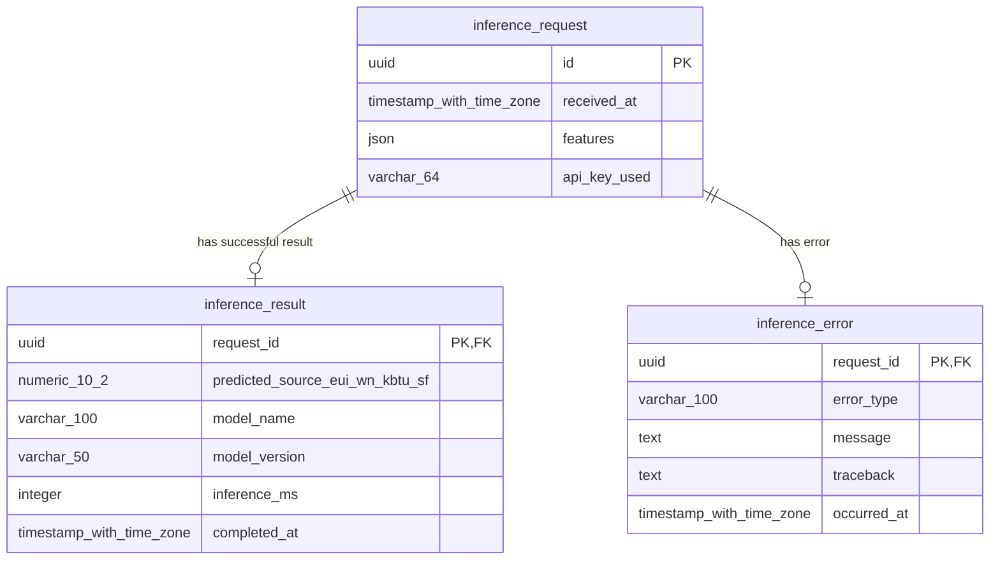

# Energy Prediction API - Database Schema

This document describes the database schema for the Energy Prediction API, which tracks inference requests, results, and errors for building energy use intensity predictions.

## Overview

The database consists of three main tables that track the lifecycle of prediction requests:

1. **inference_request** - Central table storing all incoming prediction requests
2. **inference_result** - Stores successful prediction outcomes
3. **inference_error** - Stores error information for failed requests

## Database Schema

### Schema Diagram (Mermaid)



### Schema Diagram (Markdown Tables)

#### Tables Overview

| Table Name | Purpose | Primary Key | Foreign Keys |
|------------|---------|-------------|--------------|
| `inference_request` | Central audit trail for all prediction requests | `id` (UUID) | None |
| `inference_result` | Successful prediction results and metrics | `request_id` (UUID) | `request_id` → `inference_request.id` |
| `inference_error` | Error details for failed predictions | `request_id` (UUID) | `request_id` → `inference_request.id` |

#### Table Structures

**inference_request** (Parent Table)
```
┌─────────────────┬─────────────────────────────┬──────────────┬─────────────────────────────────────────┐
│ Column          │ Type                        │ Constraints  │ Description                             │
├─────────────────┼─────────────────────────────┼──────────────┼─────────────────────────────────────────┤
│ id              │ UUID                        │ PRIMARY KEY  │ Unique identifier for each request      │
│ received_at     │ TIMESTAMP WITH TIME ZONE    │ NOT NULL     │ When the request was received           │
│ features        │ JSON                        │ NOT NULL     │ Validated input features for prediction │
│ api_key_used    │ VARCHAR(64)                 │ NULLABLE     │ Masked/hash prefix of API key used      │
└─────────────────┴─────────────────────────────┴──────────────┴─────────────────────────────────────────┘
```

**inference_result** (Success Child Table)
```
┌──────────────────────────────────┬─────────────────────────────┬──────────────┬─────────────────────────────────────────┐
│ Column                           │ Type                        │ Constraints  │ Description                             │
├──────────────────────────────────┼─────────────────────────────┼──────────────┼─────────────────────────────────────────┤
│ request_id                       │ UUID                        │ PK, FK       │ References inference_request.id         │
│ predicted_source_eui_wn_kbtu_sf  │ NUMERIC(10,2)               │ NOT NULL     │ Predicted energy use intensity kBtu/sf  │
│ model_name                       │ VARCHAR(100)                │ NOT NULL     │ Name of the ML model used               │
│ model_version                    │ VARCHAR(50)                 │ NOT NULL     │ Version of the ML model used            │
│ inference_ms                     │ INTEGER                     │ NOT NULL     │ Inference time in milliseconds          │
│ completed_at                     │ TIMESTAMP WITH TIME ZONE    │ NOT NULL     │ When the prediction was completed       │
└──────────────────────────────────┴─────────────────────────────┴──────────────┴─────────────────────────────────────────┘
```

**inference_error** (Error Child Table)
```
┌─────────────────┬─────────────────────────────┬──────────────┬─────────────────────────────────────────┐
│ Column          │ Type                        │ Constraints  │ Description                             │
├─────────────────┼─────────────────────────────┼──────────────┼─────────────────────────────────────────┤
│ request_id      │ UUID                        │ PK, FK       │ References inference_request.id         │
│ error_type      │ VARCHAR(100)                │ NOT NULL     │ Type of error (validation, inference)   │
│ message         │ TEXT                        │ NOT NULL     │ Human-readable error message            │
│ traceback       │ TEXT                        │ NULLABLE     │ Python traceback for debugging          │
│ occurred_at     │ TIMESTAMP WITH TIME ZONE    │ NOT NULL     │ When the error occurred                 │
└─────────────────┴─────────────────────────────┴──────────────┴─────────────────────────────────────────┘
```

#### Relationships Diagram

```
inference_request (1) ────────────────┐
       │                              │
       │ id                           │ id
       │                              │
       ▼                              ▼
inference_result (0..1)        inference_error (0..1)
   request_id                     request_id
   
Legend:
- (1)     = Exactly one record
- (0..1)  = Zero or one record  
- PK      = Primary Key
- FK      = Foreign Key
```

#### Data Flow

```
Request Received
       │
       ▼
┌─────────────────┐
│ inference_request│ ◄── Always created first
│ (id, features)   │
└─────────────────┘
       │
       ├─── Success ──────► ┌─────────────────┐
       │                   │ inference_result │
       │                   │ (prediction)     │
       │                   └─────────────────┘
       │
       └─── Error ────────► ┌─────────────────┐
                            │ inference_error  │
                            │ (error details)  │
                            └─────────────────┘
```

## Table Descriptions

### inference_request

Central table that stores all incoming prediction requests, regardless of outcome.

| Column | Type | Constraints | Description |
|--------|------|-------------|-------------|
| `id` | UUID | PRIMARY KEY | Unique identifier for each request |
| `received_at` | TIMESTAMP WITH TIME ZONE | NOT NULL, DEFAULT now() | When the request was received |
| `features` | JSON | NOT NULL | Validated and normalized input features for prediction |
| `api_key_used` | VARCHAR(64) | NULLABLE | Masked/hash prefix of API key used (for auditing) |

**Purpose**: Audit trail and central reference point for all prediction requests.

### inference_result

Stores successful prediction results and performance metrics.

| Column | Type | Constraints | Description |
|--------|------|-------------|-------------|
| `request_id` | UUID | PRIMARY KEY, FOREIGN KEY | References inference_request.id |
| `predicted_source_eui_wn_kbtu_sf` | NUMERIC(10,2) | NOT NULL | Predicted energy use intensity in kBtu/sf |
| `model_name` | VARCHAR(100) | NOT NULL | Name of the ML model used |
| `model_version` | VARCHAR(50) | NOT NULL | Version of the ML model used |
| `inference_ms` | INTEGER | NOT NULL | Inference time in milliseconds |
| `completed_at` | TIMESTAMP WITH TIME ZONE | NOT NULL, DEFAULT now() | When the prediction was completed |

**Purpose**: Store prediction results and track model performance metrics.

### inference_error

Captures detailed error information for failed prediction requests.

| Column | Type | Constraints | Description |
|--------|------|-------------|-------------|
| `request_id` | UUID | PRIMARY KEY, FOREIGN KEY | References inference_request.id |
| `error_type` | VARCHAR(100) | NOT NULL | Type of error (validation, inference, timeout, etc.) |
| `message` | TEXT | NOT NULL | Human-readable error message |
| `traceback` | TEXT | NULLABLE | Python traceback for debugging |
| `occurred_at` | TIMESTAMP WITH TIME ZONE | NOT NULL, DEFAULT now() | When the error occurred |

**Purpose**: Error tracking and debugging support for failed predictions.

## Relationships

- Each `inference_request` can have either one `inference_result` OR one `inference_error` (but not both)
- The relationship is enforced through foreign key constraints on `request_id`
- This ensures data integrity and provides a complete audit trail

## Indexes

The following indexes are automatically created:

- Primary key indexes on all `id` and `request_id` columns
- Foreign key indexes on `inference_result.request_id` and `inference_error.request_id`

Additional indexes may be added based on query patterns:

```sql
-- Recommended indexes for common queries
CREATE INDEX idx_inference_request_received_at ON inference_request(received_at);
CREATE INDEX idx_inference_result_completed_at ON inference_result(completed_at);
CREATE INDEX idx_inference_result_model_name ON inference_result(model_name);
CREATE INDEX idx_inference_error_error_type ON inference_error(error_type);
```

## Usage Patterns

### Successful Prediction Flow
1. Insert record into `inference_request` with input features
2. Process prediction using ML model
3. Insert result into `inference_result` with prediction and metadata

### Error Handling Flow
1. Insert record into `inference_request` with input features
2. Encounter error during processing
3. Insert error details into `inference_error` for debugging

### Common Queries

```sql
-- Get all requests with their outcomes (success or error)
SELECT 
    ir.id,
    ir.received_at,
    ir.features,
    CASE 
        WHEN res.request_id IS NOT NULL THEN 'success'
        WHEN err.request_id IS NOT NULL THEN 'error'
        ELSE 'pending'
    END as status,
    res.predicted_source_eui_wn_kbtu_sf,
    res.inference_ms,
    err.error_type,
    err.message
FROM inference_request ir
LEFT JOIN inference_result res ON ir.id = res.request_id
LEFT JOIN inference_error err ON ir.id = err.request_id
ORDER BY ir.received_at DESC;

-- Get model performance metrics
SELECT 
    model_name,
    model_version,
    COUNT(*) as prediction_count,
    AVG(inference_ms) as avg_inference_time_ms,
    MIN(inference_ms) as min_inference_time_ms,
    MAX(inference_ms) as max_inference_time_ms
FROM inference_result
GROUP BY model_name, model_version
ORDER BY prediction_count DESC;

-- Get error statistics
SELECT 
    error_type,
    COUNT(*) as error_count,
    COUNT(*) * 100.0 / (SELECT COUNT(*) FROM inference_request) as error_rate_percent
FROM inference_error
GROUP BY error_type
ORDER BY error_count DESC;
```

## Database Configuration

- **Database Name**: `energy_poc`
- **Default User**: `my_user`
- **Port**: `5432` (standard PostgreSQL port)
- **Timezone**: All timestamps use `TIMESTAMP WITH TIME ZONE` for proper timezone handling

## Backup and Maintenance

Regular maintenance tasks:

1. **Backup**: Daily automated backups recommended
2. **Cleanup**: Consider archiving old requests based on retention policy
3. **Monitoring**: Track table sizes and query performance
4. **Vacuum**: Regular PostgreSQL VACUUM operations for performance
